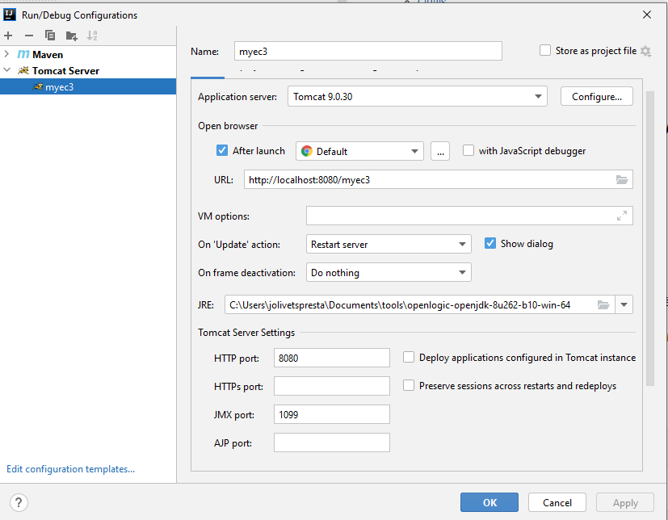
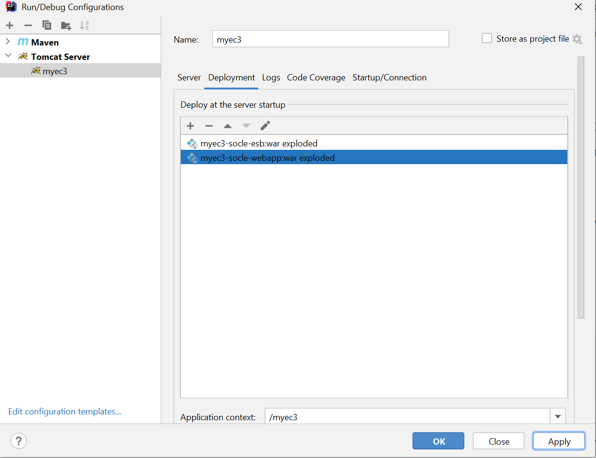
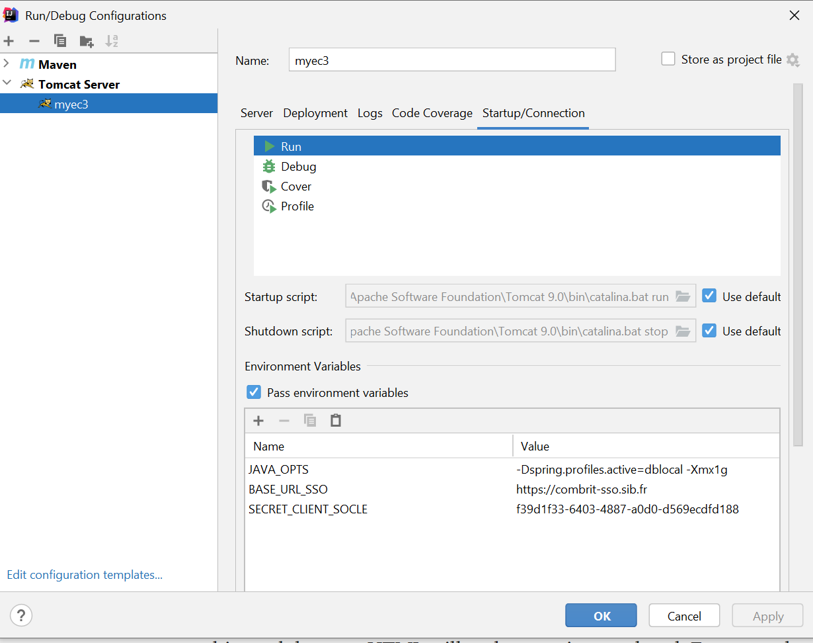
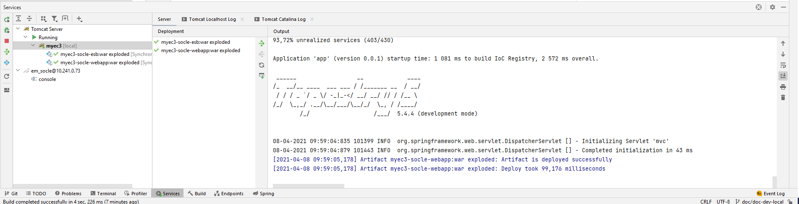
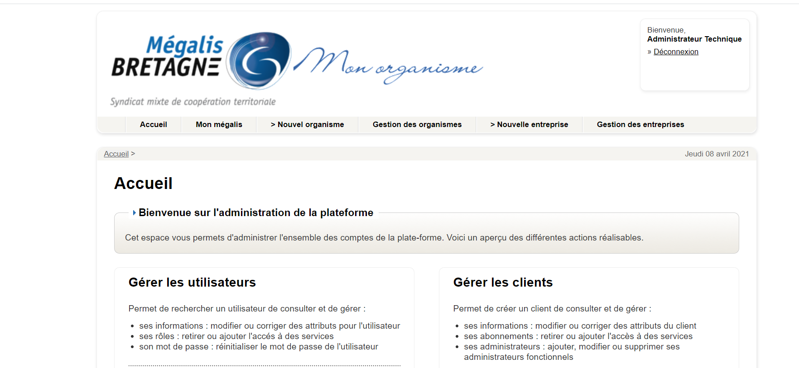

# Projet MyEC3

## Somaire
* [Installation environnement développment en locale](#to_dev)
  * [Pré-requis](#to_dev_requirement)
  * [Outils](#to_dev_tools)
  * [Déploiement du projet](#to_dev_deploy)
  * [Base de données](#to_dev_bdd)
* [Règle de développement](#to_best_practice)
* [Liens utiles](#to_link)


## Installation environnement développement en locale <a name="to_dev"></a>

### Pré-requis <a name="to_dev_requirement"></a>

* Installer JDK 1.8
* Installer [Tomcat 9.0.30](https://tomcat.apache.org/download-90.cgi)
* Installer Maven 3.6

### Outils  <a name="to_dev_tools"></a>

Il est conseiller d'utiliser la version d'intelliJ Ultimate pour réaliser le déploiement des modules directement dans tomcat.   
Sinon, le déploiement devra se faire manuellement (possibilité d'automatiser via un script) dans Tomcat.


### Déploiement du projet  <a name="to_dev_deploy"></a>
* Copier les lib externes du dossier myec3-socle-webapp-module\myec3-socle-webapp\tomcat dans le dossier lib de tomcat   
:warning: **Attention** ce dossier sera supprimé. Les librairies externes ne doivent pas être dans les sources du projet.  
* Dans le dossier myec3-socle-synchro-module/myec3-socle-synchro/src/main/config/local/db/locale 
* Copier le fichier db.properties.template en dv.properties
 * Editer le fichier pour renseigner l'adresse de la BDD

  ```
  bdd.host=10.241.0.73 //adresse de l'intégration
  bdd.port=60006
  bdd.user=MyEC3
  bdd.pwd=MyEC3 
  bdd.dump.rep=/dump
  bdd.socle.schema=em_socle
  bdd.synchro.schema=em_synchro
  bdd.keycloak.schema=keycloak
  ```
:warning: **Attention**: le mot de passe est surchargé par le fichier pwd.properties.
* Ré-itérer l'opération sur les projets myec3-socle-webapp-module/myec3-scole-webapp/src/main/config/local/db/local


Builder en locale
```
mvn clean install -P dblocal
```  
Sous IntelliJ Ultimate éditer une nouvelle configuration
  

Dans l'onglet deployment, sélectionner à minima les modules 
* myec3-socle-esb:war exploded
* myec3-socle-webapp:war exploded

  
Dans l'onglet Startup/Connection ajouter les trois variables d'environnement ci-dessous
* JAVA_OPTS -Dspring.profiles.active=dblocal -Xmx1g
* BASE_URL_SSO  https://combrit-sso.sib.fr
* SERET_CLIENT_SOCLE f39d1f33-6403-4887-a0d0-d569ecdfd188

  (Vous pouvez le faire également pour le mode debug)
  
Exécuter le tomcat server depuis intelliJ et attendre le bon déploiement des wars

Se rendre sur la page http://localhost:8080/myec3. Une redirection vers le Keycloak d'intégration est effectué.  
Login/mdp : dlfr-megalis@atos.net / emegalis!BZH35




### Base de données  <a name="to_dev_bdd"></a>
Il est possible d'utiliser une base de donné locale. Pour cela, installer un MySQL Server

Il faut crée les bases __em_socle__ and __em_synchro__.
```
mysql -u root -p
CREATE DATABASE em_socle;
CREATE DATABASE em_synchro;
CREATE DATABASE keycloak;
```
Faire un import dump de l'intégration pour initialiser les données


## Règle de développement <a name="to_best_practice"></a>

### Développement de feature/fix non urgent
Pour traiter un ticket JIRA, suivre le process suivant :
* Se mettre sur develop
  ```  
  git pull
  ```  
* Tirer une branche avec le nom feature/MEGALIS-[ID-JIRA]-description
* Mettre le ticket JIRA à "en cours" 
* Réaliser le dev sur cette branche, tester en locale.
* Une fois le dev terminé, faire une merge request de la branche vers develop
* Passer le ticket JIRA à "Test/review"
* une autre personne va lire la MR et déployer en intégration pour valider la correction

### Développement de hotfix urgent
Pour traiter un ticket JIRA urgent (incident en prod), suivre le process suivant :
* Se mettre sur master
  ```  
  git pull
  ``` 
* Tirer une branche avec le nom hotfix/MEGALIS-[ID-JIRA]-description
* Mettre le ticket JIRA à "en cours"
* Réaliser le dev sur cette branche, tester en locale.
* Une fois le dev terminé, faire une merge request de la branche vers master ET develop
* Passer le ticket JIRA à "Test/review"
* Une autre personne doit lire la MR puis déployer rapidement en prod


### Bonne pratique GIT
Nommage des branches :
* feature/MEGALIS-[ID-JIRA]-description
* hotfix/MEGALIS-[ID-JIRA]-description

Message de commit :
* [FEAT] MEGALIS-[ID-JIRA] : description détailler du dev
* [FIX] MEGALIS-[ID-JIRA]: description détaillé du fix

:warning: ** ATTENTION** chaque commit doit être tracable par le numéro du ticket JIRA. La description doit être claire et assez détaillé.
Eviter les commentaires "oups", "fix" etc...

### Présentation du CI

[voir le PowerPoint](doc/GitFlowMyEC3.ppt)

## Liens utiles

### Applications

|   Service\Domaine  | Intégration  | Pré-prod   | Prod  |
| ------------------ | ------------ | ---------- | ----- |
| Dashboard Exploitation | https://combrit-exploit.sib.fr/  | https://exploit-preprod.megalis.bretagne.bzh/ |   https://exploit.megalis.bretagne.bzh/ |
| MyEC3                  | https://combrit-socle.sib.fr/    | https://socle-preprod.megalis.bretagne.bzh/   |   https://socle.megalis.bretagne.bzh/   |
| Portainer              | https://combrit-exploit.sib.fr/portainer/# | https://exploit-preprod.megalis.bretagne.bzh/portainer/#/ | https://exploit.megalis.bretagne.bzh/portainer/#/ |


### VM de DEV

|  VM  | ip | login
| ----- | ---- | ---- |
| Combrit | 10.241.0.73 | root |
| locronan | 10.241.0.30 | root |